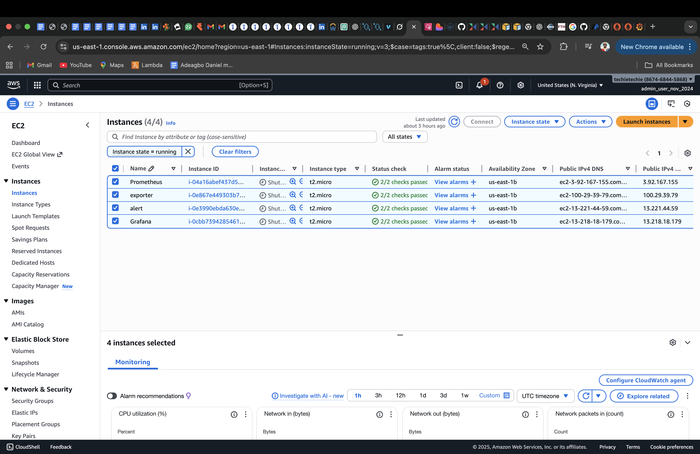
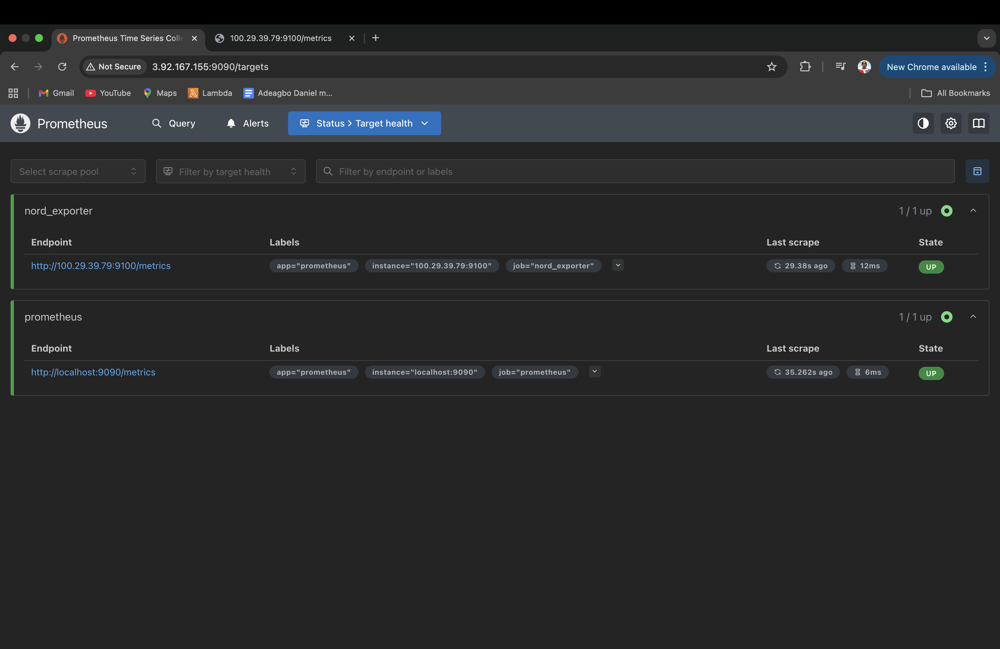
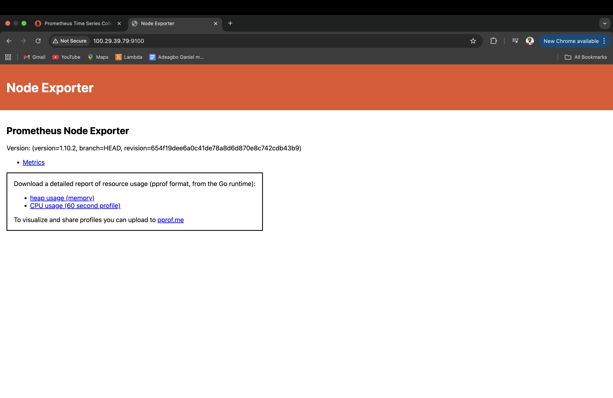
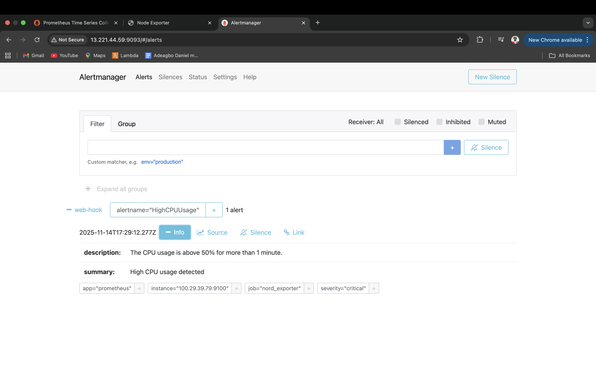

# Prometheus Monitoring Setup
 
This project demonstrates how to build a complete monitoring stack using Prometheus, Node Exporter, Grafana, and Alertmanager on AWS EC2 instances.
The goal is to monitor the CPU usage of a target EC2 instance and trigger alerts through Alertmanager.

# The project uses four EC2 instances: Node Exporter → Prometheus → Grafana + Alertmanager
[]

# Steps

1. Install Prometheus and make sure its running in the back-end
[]

---

2. Install Node_Exporter, make sure its running in the back-end and Configure Prometheus to Scrape Node Exporter
[]
---

3. Install , Configure Alertmanager and Create Prometheus Alert
[]

---

4. Install Grafana & Add Prometheus as Data Source
[]

# **Summary**
This project sets up a complete monitoring and alerting stack on AWS using Prometheus, Node Exporter, Grafana, and Alertmanager. Prometheus collects metrics from a target EC2 instance , while Grafana visualizes the data through dashboards. Alertmanager is fully integrated to trigger notifications based on defined alert rules, such as detecting high CPU usage. This setup demonstrates real-world DevOps monitoring practices, including metric scraping, alerting, visualization, and infrastructure observability across multiple EC2 instances.